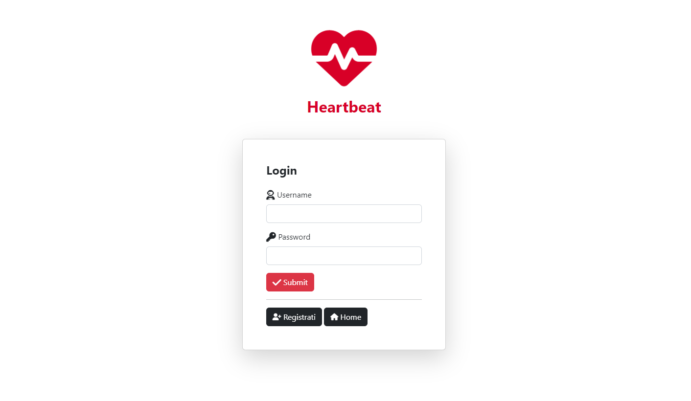

# Web-Java-Servlets-Project
A project made in Java with the use of Servlets by me and other 4 colleagues of the Computer Science course of la Sapienza University assigned by our teacher Paolo Bottoni.

The course name was "Programmazione Web".

The theme of the project were web applications and it was focused on the server side / back-end programming.
It is entirely made with java with some little html, css bootstrap and javascript and of course mysql for the database part.

The web site was supposed to let users sign-in, login buy products and let some special users like vendors add their products and let the admins do some other "special" tasks.
Below some images to show the website from different users perspectives:

Home - Normal User Perspective

Products Bought

Login

Home - Admin Perspective

Product Review

Admin Page

Modify Page

